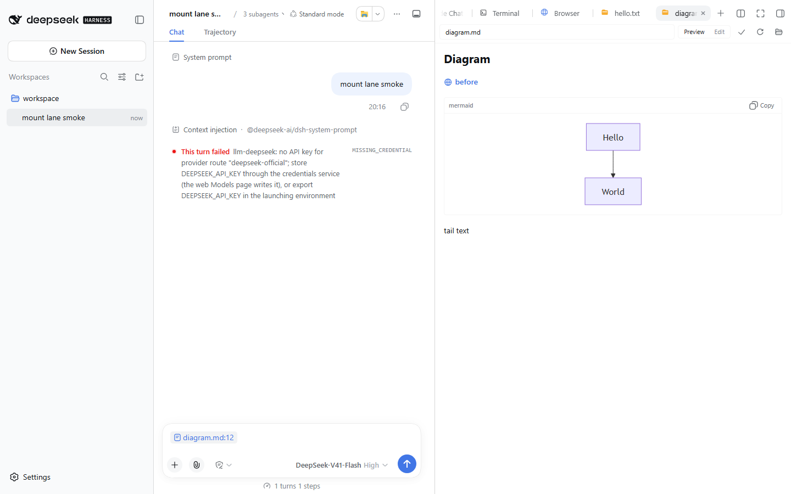

# 选区引用胶囊：把「添加到对话」从铺开正文改成 chip

日期：2026-09-12　分支：`feat/selection-chip`

## 背景

侧边栏文本查看器（markdown 预览 + catch-all 代码查看器）选中文字后点浮层的「添加到对话」，draft 里插进去的是一段**围栏代码块**（info line = `相对路径:起止行`，正文 = 选中文字）。

单次引用没问题；连续引用几段就出问题：正文把输入框铺满，用户真正要写的那句话被挤没影了。而 DSH 自己的 `@file` 引用在同一个输入框里是**一个紧凑 chip**（图标 + 文件名）——同一块屏幕上，两种引用语气的反差就是这次的诉求：**引用只要一个标识，正文交给模型**。

目标：选区的呈现改用 chip（label = `相对路径:起止行`），**发给模型的正文一字不减**，插入位置契约（#425）不回退。

## 现状与机制（为什么插件侧就能做到）

| 事实 | 位置 | 结论 |
|---|---|---|
| 输入框是宿主的 Lexical contenteditable composer，引用条目是 `ReferenceChipNode`（原子 decorator 节点） | `dsh-client-ui-conversation` 的 `ComposerContentEditable` / `chip-node` | chip 是**真 DOM 元素**，插件只需请求宿主插入 |
| chip 显示 `label`，草稿串里占 `clipboardText`，发送时按 occurrence 的 `span` 换回 `serializeReference(source, ref)` | `sinkSerialized`（同包 `client.js`） | **显示**与**模型文本**是两个字段，可以不同 |
| 宿主 `reference` source 的 codec 是恒等：`{ clipboardText: ref => ref, serialize: ref => ref }` | `dsh-client-ui-reference` | 复用该 source 即可让 chip 原样携带任意文本 |
| 插件的文件树 @ 按钮已经在用宿主事件 `slash/input-insert-reference` | `src/client/conversation-draft.ts` `insertFileReference` | 无需新通道、无需碰 `inputTriggers` |
| `ReferenceChipNode.__invalid` 只由 `setInvalid()` 置位，而全 `@deepseek-ai/*` 包内**没有任何调用点** | grep `setInvalid(` = 定义 1 处 + `.d.ts` 1 处 | 合成的 ref 不会被判非法（不会打红标） |

## 决策

| # | 决策 | 理由 |
|---|---|---|
| 1 | 复用 `slash/input-insert-reference`（`source: 'reference'`），不注册插件自有 trigger source | 与文件树 @ 按钮同一条已上线路径；注册 source 要经宿主内部 `inputTriggers` 注册表，零收益 |
| 2 | chip label = `相对路径:起止行`（与围栏 info line 同串）；超过上限时 label 与正文同为该行 | 与 DSH 原生文件 chip 同款观感；多段引用可区分来源；**不需要**给 21 份词典加新词条（`locales.spec` 强制 key 集相等） |
| 3 | chip 的 `clipboardText` = `ref` = 改动前那段围栏块（含 splice 的连接空格） | 草稿串与改动前**逐字相同**，序列化出的 prompt 随之相同（宿主最后还会 `trim`）——这是一次纯显示形态变更 |
| 4 | 保留 `SELECTION_LIMIT = 500` 的超限语义（超限只引用位置、不带正文） | 上限的成本理由是上下文 token，与显示形态无关 |
| 5 | span 的坐标是**编辑器 detect 投影**（chip 在其中只占 1 个字符），由 `foldClipboardOffset` 从草稿偏移折算；插入位置沿用 #425 的光标探测，探测不到则末尾追加 | 宿主 composer 是 Lexical contenteditable，**没有 `<textarea>`**，探测在本机恒为 null（实际一直是末尾追加）；而坐标不折算时，草稿里一有 chip 就会被宿主判为越界 |
| 6 | chip 路径**不**调用 `placeComposerCaretAfterInsert` | 宿主事件本身 span-CAS 并接管光标；DOM 光标恢复只服务 `setDraft` 那条路径 |
| 7 | chip 路径不可用（无 `draftRev`／缺会话 scope 或 conversation 服务）时才回退 `appendToDraft`；`appendToDraft` 自身在草稿已有 chip 时改走 `slash/input-insert-text`，不再用 `setDraft` | `setDraft` 会 `root.clear()` 重建纯文本段落，**摧毁文档里每一个 chip**——「降级」绝不能以清空草稿为代价 |
| 8 | `useSelectionPopup` 泛型化，默认 `T = string` | 浮层只负责「搬运一个 payload」，字符串调用方（既有测试）零改动 |

## 改动清单（子系统级）

| 子系统 | 文件 | 变更 |
|---|---|---|
| 载荷 | `src/client/selection-payload.ts` | `buildSelectionInsert` 返回 `SelectionInsert { label, text }`（原返回单个字符串）；`headerOf` / `linesOfSelection` / `SELECTION_LIMIT` 不变 |
| 插入 | `src/client/conversation-draft.ts` | 抽出 `composerInput` / `emitChip` 两个模块内助手；新增 `insertSelectionReference` 与纯函数 `chipTextAt`（插入片段连同连接空格一起取自 `spliceInsert`，不再复述空白规则）；`insertFileReference` 改走同一助手，行为不变（仍末尾追加）。`spliceInsert` 现在同时回报「插入了什么」 |
| 浮层 | `src/client/selection-popup.ts` | `SelectionPopup<T = string>` / `SelectionPopupOptions<T = string>` / `SelectionPopupControls<T = string>` / `useSelectionPopup<T = string>`（三个导出接口都带默认参数，裸引用仍能编译） |
| 接线 | `src/client/TextEditor.tsx` | `useSelectionPopup<SelectionInsert>`；commit 先试 chip，失败回退 `appendToDraft(insert.text)` |
| 类型镜像 | `src/context-types.ts` | `SidebarSessionInput.state.getSnapshot()` 补 `occurrences` / `phase`（宿主 `InputState` 的镜像），新增 `SidebarSessionOccurrence` |
| 接线 | `src/client/reference-in-chat.ts` | 目录分支加注释说明它已被 `appendToDraft` 的 chip 保护覆盖（无行为变更） |
| 测试 | `tests/selection-payload.spec.ts` | 载荷形状（含超限时 label 与正文同为路径行） |
| 测试 | `tests/conversation-draft.spec.ts` | `chipTextAt`（连接空格、选中区替换、未知光标、**拼回纯文本等价表**）；双投影假机 `fakeChipCtx`（同时维护 detect / clipboard 两个投影、校验派发主体带会话 scope、按宿主规则补分隔空格）；`insertSelectionReference` 9 例 + `foldClipboardOffset` 6 例 + `appendToDraft` 在有 chip 草稿上的 4 例 + `insertFileReference` 2 例 |

无 i18n、无样式、无对外 API 变更：`insertFileReference` 与 `useSelectionPopup()` 的既有调用语义原样保留。

## 两套坐标系（修复：第二次引用退化成铺开正文）

宿主对输入框维护**两个投影**（`$composerLayout`，`dsh-client-ui-conversation/lib/client.js:12325`）：

| 投影 | 一个 chip 占多长 | 谁在用 |
|---|---|---|
| clipboard（`InputState.draft`、`occurrences`） | 整个 `clipboardText` | 插件：读草稿串、算 splice、算 chip 文本 |
| detect（`detectText`） | **1 个字符** `U+FFFC` | 宿主：所有插入/替换事件的 `span` |

`insertReference`（:12976）拿 span 去 `$replaceDetectSpanWithNodes`，越界即 `applied = false`。于是：

- 草稿为空时两套坐标重合，**第一次插入成功**；
- 草稿里一旦有 chip，`draft.length` 远大于 detect 长度，**未折算的 span 必被拒绝**；
- 被拒后旧实现回退 `appendToDraft` → `setDraft`（:12758）`root.clear()` 重建纯文本 → **输入框里所有 chip 被抹平、正文铺开**——即用户报的症状。

修复：`foldClipboardOffset`（`src/client/conversation-draft.ts`）按 `occurrences` 把草稿偏移折到 detect 偏移——chip 整体在偏移之前则减去 `length - 1`，偏移落在 chip 展开内部则吸附到该 chip 的尾边（宿主只允许整 chip 替换）。宿主内部有同款 `detectOffsetOfClipboardOffset`（:12410），但不对外暴露；公开契约里的 `occurrences` 正是为此准备的。唯一有意的偏离：偏移正好落在 chip **起点**时，我们返回 chip **之前**的位置（宿主循环会把它误读成 chip 内部、返回其尾边）。

## 已知边界

- **全空白草稿**：改动前的纯文本路径会把全空白草稿整体替换成 payload，chip 只能占住自己的 span，空白留在 chip 前面（`'   '` + chip）。宿主提交前 `trim`，模型侧无差异。
- chip 的 `clipboardText`/`ref` 都带 splice 的连接空格，宿主又会在 chip 后自动补一个分隔空格：**末尾追加**（真机的唯一路径）时草稿尾部因此多一个空格。宿主提交前 `trim`，模型侧无差异。（`clipboardText` 另会剥掉字面占位符、`ref` 不会，见上表修正 2。）
- **会话重挂载会丢 chip（未处理）**：宿主用持久化的草稿串回灌草稿（`setDraft` = `root.clear()` + 纯文本段落），chip 节点无法从字符串恢复——堆了几段引用后切走会话再切回（或刷新页面），引用会退化成铺开的围栏正文。chip 的 `clipboardText` 正是整段正文，所以退化最刺眼；原生 `@file` chip 的 clipboardText 只有 `@path`，同样丢 chip 但只退化成一行。要修的方向是让 `clipboardText` 取短形态（label）、把整段正文留在 `ref`，但那会改变草稿串的语义（剪贴板/镜像投影不再等于模型文本），需单独决策。
- chip 的图标是宿主 `appearance: 'file'` 的文件图形（宿主自己画的），插件不新增任何字形或颜色——皮肤契约（指南 §12 / `tests/theme.spec.ts`）不受影响。

## 验证

- `pnpm typecheck` / `pnpm lint` 通过。
- `pnpm test`（全量，`--maxWorkers=1`）：**1351 passed / 3 failed**，3 例全部是本机 `tests/fs-operations.spec.ts` 创建符号链接报 `EPERM`（Windows 权限差异，与本改动无关）。本改动相关：`tests/conversation-draft.spec.ts` 36 passed、`tests/selection-payload.spec.ts` 16 passed、`tests/selection-popup.spec.tsx` 8 passed。
- **真机挂载冒烟**（真实 `dsh web` + 官方 `dsh plugin add` 产物 + 无头 Chromium）：基线 lane **7 passed**；加上本改动新增的探针后仍 **7 passed**。探针在 markdown 预览里选中种子文件的一行、点浮层的提交按钮，断言 composer 里出现 `diagram.md:12` 胶囊（不走胶囊路径的宿主会退化成纯文本，这条断言就是用来发现它的）：

  

  平台注记：`scripts/e2e-mount.sh` 在 Windows 上会把 tarball 路径转成 POSIX 形式（`/e/…`），被 pnpm 解析成 `E:\e\…` 而失败——与本改动无关的平台差异。本机用逐步对齐 `e2e-common.sh` 的 PowerShell 版本跑同一条 lane（scratch profile 三件套 + `dsh plugin add` + `dsh web --port 0 --no-open` + `playwright test`），CI 仍走原脚本。

### 第二次引用修复（2026-09-12 追加）

审查（`/code-review` + `/simplify`）后又落了三处修正，都在坐标主线之外：

| # | 修正 | 理由 |
|---|---|---|
| 1 | 事件派发改用 `bail(actx, name, payload)` —— 把会话 scope 作为**派发主体**传回 | cordis 只在首参是对象时才应用会话监听器过滤；不传则事件广播给**所有已挂载会话**的输入框，而各 shell 的 `rev` 都从 0 起，span CAS 挡不住这种串台 |
| 2 | chip 的 `clipboardText` 剥掉字面 `U+FFFC`（`ref` 保持原样） | 字面占位符落在文本节点里会**伪造 chip 位置**，此后所有按 `occurrences` 折算的 span 全部错位；`ref` 不进编辑器，模型仍收到未删改的载荷 |
| 3 | `appendToDraft` 在入口统一相位守卫（镜像宿主的 `plain \| claimed` 白名单）；`spliceInsert` 的「追加」分支补上空白感知 | 原先守卫只装在 chip 那条分支上，同一手势在有无 chip 的草稿上行为相反；追加分支无条件补前导空格，与宿主 chip 后的分隔空格叠成两个 |

验证：

- `tsc --noEmit`、`eslint src tests` 通过。
- 全量 `vitest run`：**1365 passed / 3 failed**，3 例仍是 `tests/fs-operations.spec.ts` 的符号链接 `EPERM`（Windows 环境差异，与本改动无关）。`tests/conversation-draft.spec.ts` **50 passed**（含 `foldClipboardOffset` 六例、第二次插入的回归例、`appendToDraft` 在有 chip 草稿上的四例、`insertFileReference` 两例、占位符防护例）。
- **真机 mount lane（同上的 PowerShell 版编排）：5 passed**。lane 里是用户实际做的两个手势——在预览里选中同一行、点「添加到对话」，再选一次、再点一次，断言 composer 里出现**两个** `diagram.md:12` 胶囊（第一个没被碾平），且 composer 的文本里没有三反引号围栏。

